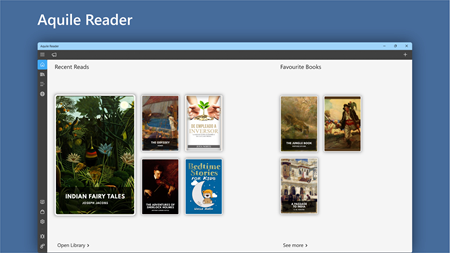
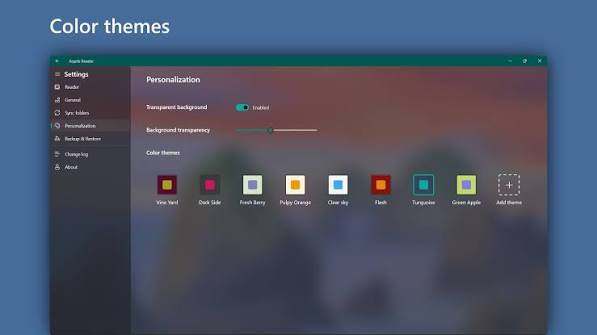
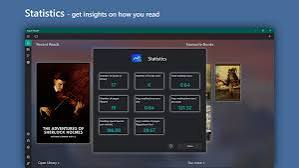

# Aquile Reader

Aquile Reader is a reader for ebooks, PDF, comics, and manga on Windows and Android. aquile reader epub means a DRM-free EPUB. PDF, CBR, and CBZ open in the same library. aquile reader windows and aquile reader android share progress, bookmarks, notes, and highlights.

Aquile Reader Premium is the paid line of the same app. The free build already reads, speaks, and themes. Premium is the extra study set, not a second reader.

A built-in shelf holds a large public-domain catalog. Your own files stay in the library beside those classics.

Library host is MainTabs2.java at pack root. Reader shell is [readerui.lua](readerui.lua). Session store is sessions.ts next to it.

## Main features

- aquile reader epub, PDF, CBR, and CBZ
- Sync between aquile reader windows and aquile reader android
- Public-domain shelf
- Read-aloud with speed and voice
- aquile reader dark mode, sepia, and a paper theme
- Fonts, margins, line spacing, two columns, or vertical scroll
- Dictionary, translation, notes, and reading stats
- Aquile Reader Premium for the extra study tools

| Format | How it opens |
| --- | --- |
| EPUB | Reflow, DRM-free |
| PDF | Pages, zoom, notes |
| CBR / CBZ | Comic and manga pages |
| Notes | Tied to the book, synced |

| Edition | What you get |
| --- | --- |
| Aquile Reader | Read, theme, speak, sync |
| Aquile Reader Premium | Same reader plus study extras |
| Windows | aquile reader windows desktop |
| Android | aquile reader android phone and tablet |

EPUB extract is [EpubExtractor.java](epub/EpubExtractor.java). PDF extract is [PdfExtract.java](pdf/PdfExtract.java). Type map is [mimeTypes.ts](mimeTypes.ts).

A comic page is an image. Do not expect reflow on a CBZ the way an EPUB reflows.

## Screenshots

People post the shelf, a two-column EPUB, and a dark PDF. The live app is the page you are on, with the font you picked.

Footer sample is [readerfooter.lua](reader/readerfooter.lua). Page map is readerpaging.lua under pdf/.

## Prerequisites

aquile reader windows needs a current Windows 10 or 11 desktop. aquile reader android needs a current Android phone or tablet. Sign in with the same account if you want the library to match.

A book file can live on the device. Sync sends progress and notes, not a second copy of a huge PDF unless you choose to upload it.

Storage helper is datastorage.lua at pack root. Publication record is [publication.ts](library/publication.ts).

## Technologies

The Windows build is a desktop shell. The Android build is the phone app. They share the account, not one binary.

Keyboard map is keyboard.ts at pack root. Dependency graph is di.ts beside it. Module file is package.json. Type config is tsconfig.json.

Those files are pack samples. They do not install Aquile Reader.

## Get Aquile Reader

Use the GET badge. The Microsoft Store page is the vendor build for aquile reader windows. The Android build is the matching store listing. Aquile Reader Premium is the same listing, paid SKU.

Do not take a random APK from a portal. is aquile reader safe when the file is the store build. A mirror with a different name is not.

One account. Two devices. Sign in on both before you judge sync.

## Telemetry

Aquile Reader can count anonymous use if you leave that on. Reading notes and highlights stay in your account for sync. They are not a public feed.

Turn the extra report off in settings if you want a quiet install. The book still opens.

Recent shelf is RecentFragment2.java under library/. Config file is readerconfig.lua under reader/.

## Proxy

A work network may need the system proxy. Aquile Reader uses the Windows or Android proxy. Do not paste a machine-local loop address into a catalog field. Store a normal catalog address or a file path.

Catalog client is [opds.ts](opds/opds.ts).

## DRM

aquile reader epub in this app means DRM-free EPUB. A store file locked to another reader will not open. Remove the lock with the shop that sold it, or buy a DRM-free copy.

PDF passwords that you know can open. A password you do not have will not.

Lock helper is lcp.ts under drm/. Zip open is extract.ts under epub/.

## Command line

Daily reading is the window, not a shell. Pack samples include a keyboard map and a reader shell. They do not replace the store install.

Style tweaks are readerstyletweak.lua under theme/. Lint config is .eslintrc.js. Format config is .prettierrc.js. Lua config is .luarc.json. Gradle settings are settings.gradle.kts and gradle.properties.

## Architecture

The shelf lists books. The reader opens one. Notes and the locator sit beside the book record. Sync pushes those records, then the other device pulls them.

Locator sample is readerLocator.ts under reader/. Reader config sample is [readerConfig.ts](reader/readerConfig.ts).

Windows and Android can be open at once. The later save wins for that book if you edit the same highlight on both. Close one device if you are mid-note.

## Themes and type

aquile reader dark mode is a theme, not a separate app. Sepia and a light paper theme sit next to it. Margins, line spacing, and a two-column layout are per book or global, depending on the switch you set.

Font list sample is [fontList.ts](fontList.ts). Font module is [readerfont.lua](reader/readerfont.lua). Theme page is [PrefFragment2.java](theme/PrefFragment2.java). Custom theme sample is [customization.ts](theme/customization.ts).

You can add your own font file if the build allows a custom face. A missing font falls back to the default. The book still opens.

Vertical scroll is a mode. Page taps are the other. Comics usually want page taps. Novels often want scroll or two columns.

## Read-aloud

aquile reader text to speech uses a voice on the device. Speed is a slider. Pick a voice you can stand for a chapter, not a sentence.

Speech engine is [TTSEngine.java](tts/TTSEngine.java). Speech service is TTSService.java under tts/. Speech state is [tts.ts](tts/tts.ts).

Headphones keep the screen off on Android if the OS allows it. Windows can speak while the window is in the background if the voice session stays up.

If speech is silent, the OS voice pack is missing. Install a voice in Windows or Android settings, then return to Aquile Reader.

## Notes, dictionary, search

Tap a word for the dictionary. A second action can translate that word. Highlights and notes export if you need them in a study file.

Dictionary module is [readerdictionary.lua](dict/readerdictionary.lua). Note saga is [note.ts](notes/note.ts). Bookmark module is [readerbookmark.lua](notes/readerbookmark.lua). Highlight module is readerhighlight.lua under notes/.

Search in the book is search.ts under search/. Shelf search is SearchFragment2.java in the same folder. In-book search sample is readersearch.lua there too.

A textbook PDF with a bad text layer will not search well. That is the scan, not the app. A reflow view helps when the PDF has real text.

Table of contents is readertoc.lua under reader/. Link jumps are readerlink.lua under reader/.

## Sync

aquile reader windows android sync covers the library position, bookmarks, notes, and highlights. Start a chapter on the phone. Open the same book on the PC. The locator should meet you there after the account refresh.

Sync worker is SynctornizatoinWorker.java under sync/. Account sync is GSync.java in the same folder.

Offline reading still works. The push happens when the device is online again.

Do not put a work token in a screenshot of the note list.

## Android and Windows

aquile reader for android is the phone build. aquile reader for windows and aquile reader for pc are the desktop build. aquile reader for mac and aquile reader linux are not this pair. Use the two builds the store lists.

Rolling layout is readerrolling.lua under reader/. Scroll layout is readerscrolling.lua under reader/.

A tablet and a phone share the Android account. The Windows PC is the third screen if you sign in there too.

## Support

Store reviews are not a bug tracker. If sync fails, note the book format and which device saved last. If a font looks wrong, name the face.

Reading stats sit in the app. They are yours. A crash of one book should not wipe the shelf. Reopen the library.

## What's new

Themes, speech, and sync are the core people keep. Aquile Reader Premium is the paid name when you want the extra study tools on top of that core.

A review that says the app is quiet about payment matches a free reader with an optional Premium. You can read DRM-free files without paying.

## Safety

is aquile reader safe: use the store listing, not a repack. The app reads files you open. It does not need your email password beyond the account you use for sync.

Close the book before you replace the file on disk. A half-written EPUB will not open.

## Related Questions

**What is the best app to read free eBooks?**

Aquile Reader is a strong free choice on Windows and Android for DRM-free EPUB, PDF, and comics. The public-domain shelf is inside the app. "Best" still depends on whether you need a phone, a PC, or both.

**What is a disadvantage of using eBooks?**

You read on a screen, so long sessions tire some eyes. A locked store file will not move to Aquile Reader. Battery and glare are the other costs. A paper book does not need a charge.

**What is the best eBook reader for a laptop?**

For a Windows laptop, aquile reader windows is built for that desk: two columns, fonts, dark mode, and the same progress as the phone. A browser tab is a worse place to keep notes.

**What is the best e-reader for reading textbooks?**

Use Aquile Reader on the PDF or EPUB the course gave you, with search, highlights, and the dictionary. A scanned PDF with no text layer stays hard to search. Aquile Reader Premium is the study-side SKU when you want the extra tools on that same book.

## License

The store build of Aquile Reader and Aquile Reader Premium uses the vendor terms. One LICENSE file covers pack samples. Do not add a second LICENSE beside README.

A bookmark you drop on the phone should show on the PC after refresh. If it does not, open the book once on the PC so the record exists, then refresh again.

Two-column layout is for a wide window. A phone in portrait should stay one column. Aquile Reader Premium does not change that rule.

Sepia at night is easier for some people than full black. aquile reader dark mode is there when the room is actually dark.

Margins too tight make a PDF feel like a scan. Give the text air before you blame the font.

Line spacing is a reading tool, not a decoration. A textbook with dense lines needs more space, not a smaller face.

The public-domain shelf is classics. Your course PDF will not appear there. Import the file yourself.

A CBZ of a manga reads as pages. Do not turn on reflow and expect paragraphs.

Highlights export is for study. Keep the export next to the course folder. The app is not a bibliography manager.

Reading stats count time in the book. A paused night with the screen on can inflate the number. That is the timer, not a second clock.

If the voice rushes, lower the speed before you change the voice. A slow clear voice beats a fast one you cannot follow.

Android battery optimization can pause speech. Exempt Aquile Reader if the chapter stops when the screen sleeps.

Windows focus assist can hide a sync toast. The sync can still finish. Open the book and check the page.

A renamed file looks like a new book. Progress will not follow the new name until you open it and the match fails. Keep the file name stable.

Do not store the account password in a note inside the book.

aquile reader review posts often show dark mode and two columns. That is the same free app, not a hidden Premium-only theme.

aquile reader download should be the store, or the GET badge. A "premium crack" page is not Aquile Reader Premium.

Close a book that will not open, remove it from the shelf, and add the file again. A bad import is one row, not the whole library.

Fast user switch on Windows is a second account. Sign in there if that user wants the shelf. The first user keeps their own progress.

A tablet in a classroom and a laptop at home are the sync pair this app is for. Use the same login.

A cover that looks wrong is metadata. The pages inside can still be fine. Open the book before you delete the row.

If two devices show different pages, pull to refresh on the one that is behind. Do not start a new highlight until they match.

A finished book can stay on the shelf. Hide it if the grid is crowded. Deleting the row does not delete a store classic you can add again.

## Related Search Terms

Aquile Reader, Aquile Reader Premium, aquile reader windows, aquile reader android, aquile reader epub, ebook-reader, epub, pdf, android, windows, comics, text-to-speech, library, opds, dark-mode, bookmarks, annotations
